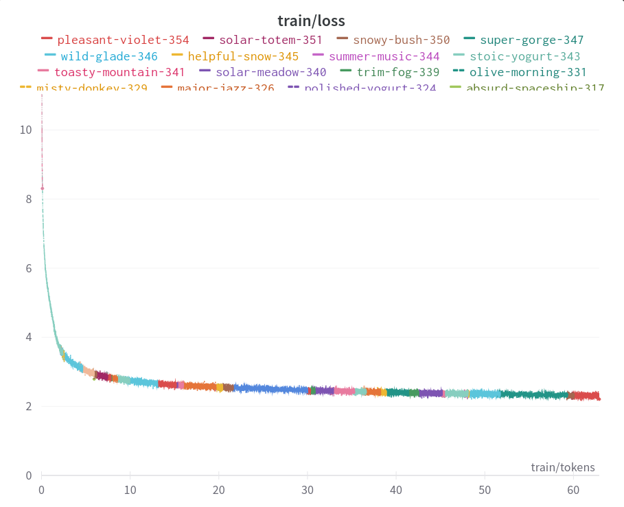

# Shard Map Tensor Parallelism

This is an implementation of [Megatron-LM](https://arxiv.org/abs/1909.08053) Tensor Parallelism using [`shard_map`](https://jax.readthedocs.io/en/latest/jep/14273-shard-map.html) in JAX. Using this codebase on a TPU V3-32, a 6.9B param transformer achieves 867 TFLOPs[^1] throughput, or 44.5% Model Flop Utilization[^2].

# Usage

## Installation

#### TPU 

```bash
git clone https://github.com/fattorib/transformer_shmap.git
cd *folder* 
bash prepareTPUVM.sh
```

#### GPU

```bash
git clone https://github.com/fattorib/transformer_shmap.git
cd *folder* 
bash prepareGPUVM.sh
```

## Benchmarks

To run the TPU benchmarks, clone and install the repo and then run:
```bash
python benchmark_tpu.py --dp *num data parallel* --mp *num tensor parallel* --version *tpu version*
```
For example, to evaluate the throughput of training a model on a V3-32 using a `(4,8)` dp/mp mesh, you would run on all TPU processes:
```bash
python benchmark_tpu.py --dp 4 --mp 8 --version v3
```

### Results 

| TPU Config | Model Params (B) | TFLOPs | MFU (%) |
|------------|------------------|--------|---------|
| V2-32      | 2.83             | 454    | 63      |
| V3-32      | 6.86             | 867    | 44      |

## Training

Due to the high rate of TPU preemptions on TRC recently, there are no fully-trained models. 

To train models:

```bash 
python main.py --cfg conf/config.yaml
```

All configuration is managed in `config.yaml`. By default, this codebase will train a model on [MiniPile](https://arxiv.org/abs/2304.08442). For use in multi-host settings or for larger datasets, swapping the basic dataloader out for something higher performance, and making use of GCP Storage buckets to stream the data in is advised. For reference, I have a working version of this [here](https://github.com/fattorib/ZeRO-transformer/blob/main/main_zero.py).

### 2.8B Parameter Loss Curves

Loss curve for the training of a 2.8B parameter transformer at 1024 ctx on [The Pile](https://arxiv.org/abs/2101.00027). Training was conducted on a mixture of preemptible V2-32 and V3-32 TPUs. Due to the flexibility of `shard_map` resuming training between different device formats is trivial, just change the mesh dimensions and keep training!



# Tests

Tests are written in [pytest](https://docs.pytest.org/en/7.4.x/) and can be run with:

```bash
pytest tests
```

# Acknowledgements

TPU Development and training supported with Cloud TPUs from Google's [TPU Research Cloud (TRC)](https://sites.research.google/trc/about/). Thank you to the excellent TRC team for granting me access to upgraded TPU VMs and for the extensions I received while working on this project! 


[^1]: Not including gradient rematerialization.
[^2]: As computed in Appendix B from [https://arxiv.org/abs/2204.02311](https://arxiv.org/abs/2204.02311)
